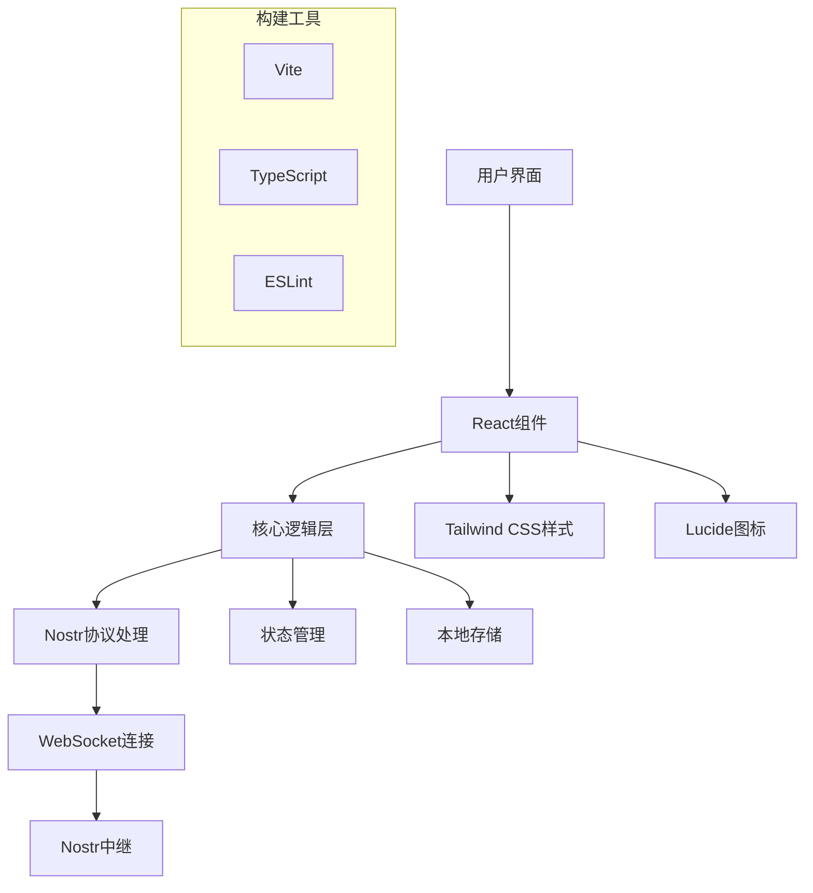

# NostrDebugger

[](https://reactjs.org/)
[](https://www.typescriptlang.org/)
[](https://tailwindcss.com/)
[](https://vitejs.dev/)
[](https://github.com/nostr-protocol/nips)

> 一个比较赤石的 Nostr 协议调试工具，帮助 (可能不会) 开发者调试、测试和监控 Nostr 网络通信。 

> A rather janky Nostr protocol debugging tool, designed to help (or possibly not help) developers debug, test, and monitor Nostr network communications.


## 📋 目录
- [✨ 主要功能](#-主要功能)
- [🚀 快速开始](#-快速开始)
- [📖 使用指南](#-使用指南)
- [🏗️ 技术架构](#️-技术架构)
- [📄 许可证](#-许可证)

## ✨ 主要功能

### 🔌 中继管理器
- **多中继管理**：添加、删除和切换多个 Nostr 中继
- **连接状态监控**：实时显示中继连接状态（连接中/已连接/断开/错误）
- **分组管理**：按功能或用途对中继进行分组管理
- **自动重连**：网络异常时自动尝试重新连接

### 🔍 事件检查器
- **灵活查询**：使用 JSON 过滤器查询 Nostr 事件
- **实时监控**：实时接收和显示事件流
- **详细查看**：查看事件的完整 JSON 结构、内容和标签
- **性能分析**：显示事件接收延迟和传播路径

### 📤 事件发布器
- **事件创建**：通过 JSON 编辑器创建自定义事件
- **多重签名**：支持 NIP-07 扩展和私钥签名
- **批量发布**：同时向多个中继发布事件
- **发布验证**：验证发布结果和确认

### 🔐 身份验证管理
- **NIP-07 扩展**：支持主流 Nostr 浏览器扩展
- **私钥管理**：支持 hex 和 nsec 格式的私钥
- **密钥生成**：内置安全的随机密钥生成器
- **身份切换**：快速在不同身份间切换

### 📊 实时控制台
- **网络日志**：记录所有 WebSocket 通信
- **方向标识**：清晰区分入站(IN)和出站(OUT)消息
- **类型过滤**：按事件类型、中继等条件过滤日志
- **时间戳**：精确到毫秒的本地时间显示

### 📱 响应式设计
- **移动端优化**：完美适配手机和平板设备
- **暗色主题**：专业的深色界面，减少眼睛疲劳
- **交互优化**：流畅的动画和直观的用户界面

## 🚀 快速开始

### 环境要求
- Node.js 18 或更高版本
- pnpm（推荐）或 npm

### 安装步骤

1. **克隆仓库**
   ```bash
   git clone <repository-url>
   cd ndebug
   ```

2. **安装依赖**
   ```bash
   pnpm install
   ```

3. **启动开发服务器**
   ```bash
   pnpm dev
   ```

4. **打开浏览器**
   访问 `http://localhost:5173`

### 生产构建
```bash
pnpm build
```

构建后的文件将位于 `dist` 目录中。

## 📖 使用指南

### 1. 配置中继
1. 点击 "Settings" 标签页
2. 在 "Relay Manager" 区域添加中继 URL（如 `wss://relay.damus.io`）
3. 点击连接按钮或切换激活状态

### 2. 查询事件
1. 切换到 "Inspector" 标签页
2. 在 FILTER 文本框中输入 JSON 过滤器，例如：
   ```json
   {
     "kinds": [1],
     "limit": 10,
     "authors": ["author-pubkey"]
   }
   ```
3. 点击 "REQ" 按钮开始查询
4. 在事件列表中选择事件查看详细信息

### 3. 发布事件
1. 切换到 "Publish" 标签页
2. 配置身份验证（NIP-07 扩展或私钥）
3. 在编辑器中输入事件 JSON：
   ```json
   {
     "kind": 1,
     "content": "Hello from NostrDebugger!",
     "tags": [],
     "created_at": 0
   }
   ```
4. 点击 "Sign & Publish" 按钮发布

### 4. 使用控制台
1. 点击底部控制台栏展开/收起
2. 查看实时网络通信日志
3. 使用清除按钮清空日志

## 🏗️ 技术架构



### 项目结构
```
.
├── src/
│   ├── app.tsx          # 主应用组件 (NostrDebugger)
│   ├── main.tsx         # React 应用入口
│   └── index.css        # 全局 Tailwind CSS 样式
├── index.html           # HTML 模板
├── package.json         # 项目依赖和脚本配置
├── vite.config.ts       # Vite 构建配置
├── tsconfig.json        # TypeScript 根配置
├── tsconfig.app.json    # 应用 TypeScript 配置
├── tsconfig.node.json   # Node.js TypeScript 配置
├── eslint.config.js     # ESLint 配置
├── pnpm-lock.yaml       # pnpm 锁文件
└── README.md            # 项目文档
```

### 核心技术栈
- **前端框架**: React 19 + TypeScript
- **样式方案**: Tailwind CSS 4
- **构建工具**: Vite
- **Nostr 库**: nostr-tools
- **图标库**: lucide-react
- **代码质量**: ESLint + TypeScript 严格模式

## 📄 许可证

本项目采用 MIT 许可证。详见 [LICENSE](LICENSE) 文件。